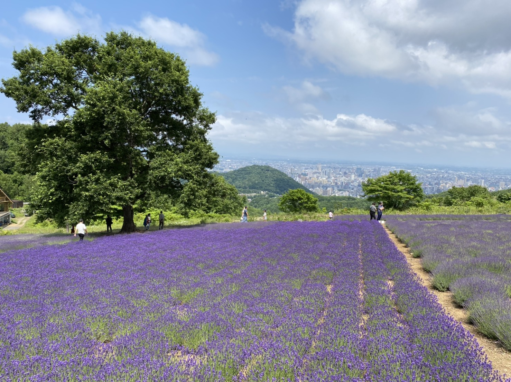
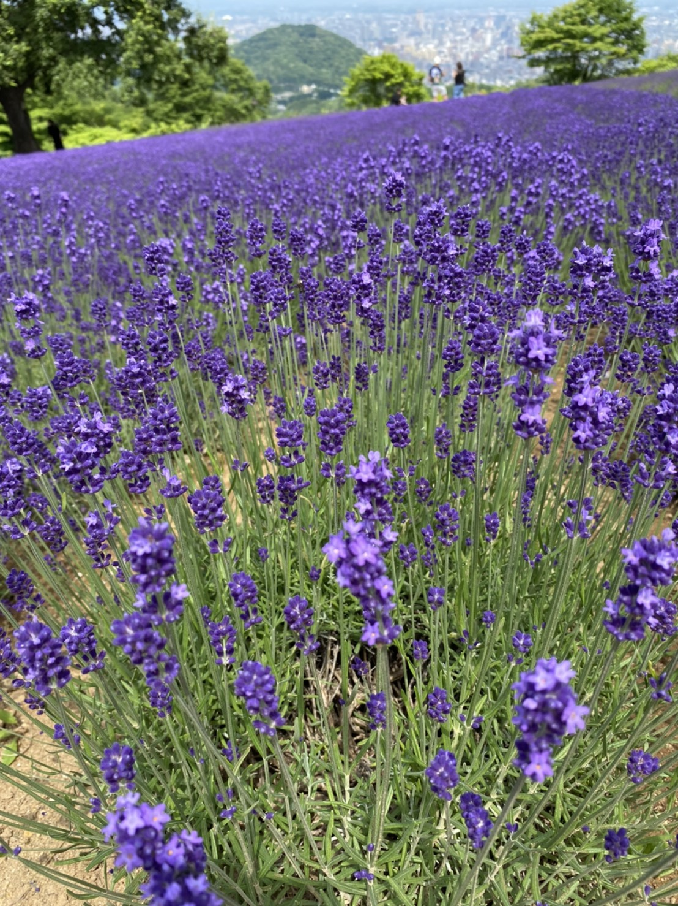
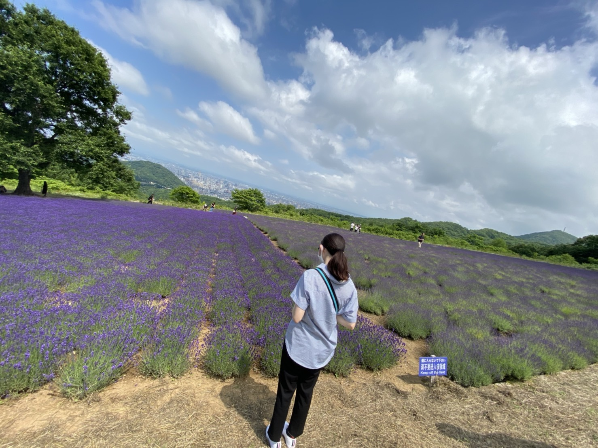

# diary
<!DOCTYPE html>
<html>
<head>
  <meta charset="utf-8">
  <meta name="description" content="やえの日記"/>
  <title>やえの日記</title>
  <link href="https://maxcdn.bootstrapcdn.com/font-awesome/4.7.0/css/font-awesome.min.css" rel="stylesheet" integrity="sha384-wvfXpqpZZVQGK6TAh5PVlGOfQNHSoD2xbE+QkPxCAFlNEevoEH3Sl0sibVcOQVnN" crossorigin="anonymous">
  <link rel="stylesheet" type="text/css" href="stylesheet.css">
  </head>
  <body>
    <!-- ここからHTMLを書き始めてください -->
    <header>
      

        

          <a class="profile">やえの日記<a>
        

      

    </header>

    

      

        

          <h3 clas ="co">ラベンダーといえば…</h3>
            

            ラベンダーといえば、富良野。しかし札幌からは遠い。 
            私の実家からファーム富田までは高速を使って2時間13分(Google Maps調べ)。 
            しかしラベンダーの季節(7月らへん)にせっかく北海道に帰省している私はどうしてもラベンダー畑を見たかった。 
            そんな時、母から幌見峠の存在知らされた。ここなら車で10分ほどで行けるらしい。そして2020年7月12日、母が 
            山道を車で走り、途中痩せこけたキタキツネを横目に見ながら目的地に到着。 その時の写真が↓  
            

            
            
            
            

            思ったよりも規模が大きくてびっくり！ファーム富田をそこまで知らない私には十分楽しめた。 
            ラベンダーは7000株ほどあるらしい。山の上にあるので札幌市の景色もきれい。夜なら夜景きれいなんだろうなあ。 
            でもラベンダー見えないよなあ。
           

        

        
      

    

  </body>
</html>
